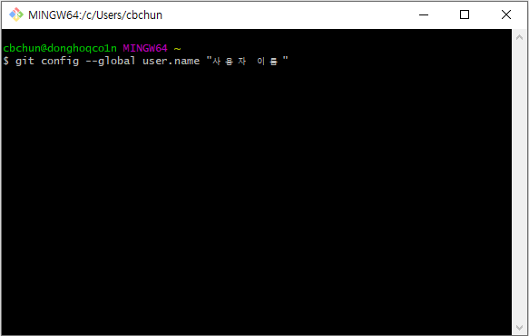
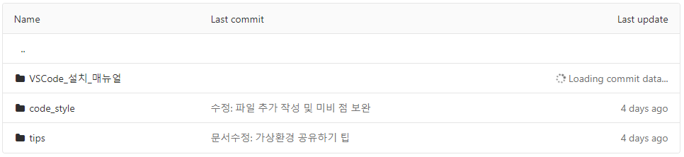
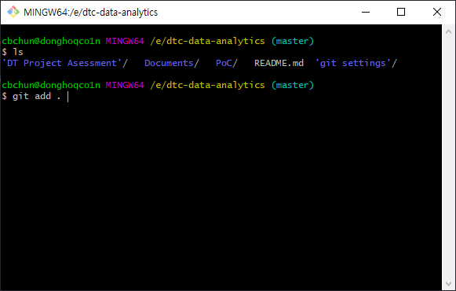
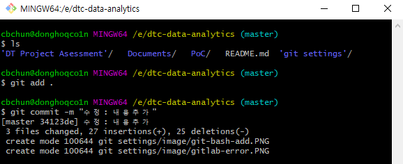
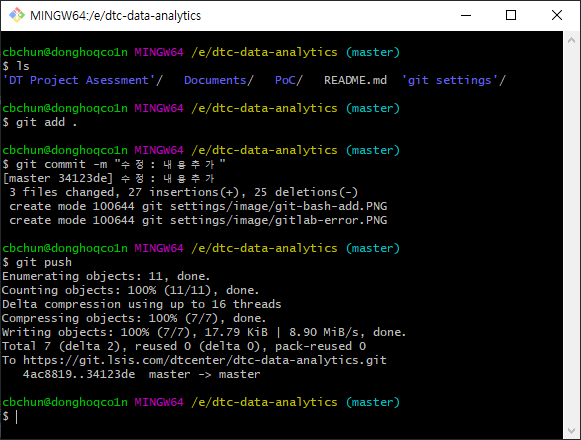
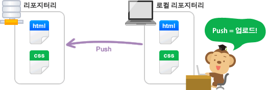
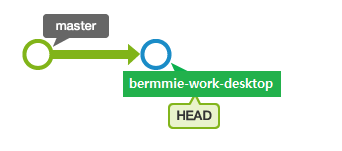
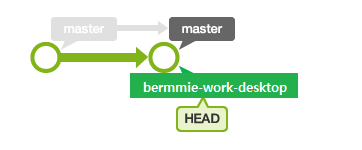

# GitLab 사용법 👩‍💻
_Last updated: 2020-12-07_

## Quick Start


### 0. 목차
1. 사용자 정보 설정
2. 옵션 설정
3. remote `repository` clone
4. 주요 명령어
---

### 1. 사용자 정보 설정

#### 사용자 이름 설정
우선 git을 사용하는 사용자의 이름을 지정해줍니다.
사용자 이름은 `commit`을 하게 되면 `git log`에 `author`로 기재 됩니다.
```git
git config --global user.name "사용자 이름"
```



그래서 본인 또는 같은 `repository`를 사용하는 다른 사용자들에게 보여지고 싶은 이름으로 설정하면 됩니다. 원한다면 사용하는 기기 마다 다른 이름으로 설정해 차이를 나타낼 수 있습니다.

``` git
# 예시
git config --global user.name "cbchun"

# 업무용 데스크탑에 설정된 사용자 이름
git config --global user.name "bermmie-work-desktop"
# 노트북에 설정된 사용자 이름
git config --global user.name "bermmie-work-laptop"
```
<br>

#### 사용자 이메일 설정
사용자 이름으로 사용자가 누구인지 밝혔다면 이어서, contact point를 알리기 위해 사용자 이메일을 설정해야 한다. 이메일 또한 `git log`에 기재되어 다른 사용자들에게 보여질 수 있습니다.
``` git
git config --global user.email "사용자 계정@lselectric.co.kr"
```
``` git
# 예시
git config --global user.email "cbchun@lselectric.co.kr"
git config --global user.email "bermmie1000@gmail.com"
```
<br>

#### 참고 사항
`--global` 옵션을 사용하게 되면 로컬 환경의 모든 위치에서 설정된 정보를 사용할 수 있습니다. 만약 어떠한 이유로 특정 위치에서만 다른 사용자 정보를 설정하고 싶다면 `console`에서 해당 위치로 이동한 후 `--local`옵션을 사용하여 아래와 동일한 방법으로 사용자 정보를 설정하면 됩니다.
<br>

---

### 2. 옵션 설정

#### 보안 설정
아래의 옵션으로 보안 설정을 변경하여 `gitLab` 사용을 가능하게 합니다.
``` git
git config --global http.sslVerify false
```
<br>

#### 한글 경로
한글 경로 즉, 한글로 기재된 폴더명과 파일명은 `gitLab`에서 `Loading commit data...`오류를 일으킵니다. 데이터는 정상적으로 업로드 되지만 `Last update`부분이 가려져 시간을 알 수 없게 되기 때문에 폴더명과 파일명은 영어로 지정해야 합니다.


<br>

---

### 3. remote `repository` clone
다수의 방법으로 remote `repository`를 사용자가 원하는 위치에 clone할 수 있습니다.

`console`을 사용하는 경우는 아래와 같습니다.


#### 경로 변경
`console`에서 `cd` 명령어를 사용해 원하는 디렉토리로 이동합니다.
``` git
cd "원하는 디렉토리"
```
<br>

#### clone
경로 변경 후 원하는 `repository`의 URL을 아래의 명령어와 같이 사용하면 된다.
``` git
git clone "URL"

# 예시
git clone https://git.lsis.com/cbchun/dx-lab-wiki.git
```
<br>

---

### 4. 주요 명령어
로컬 `repository`의 데이터를 `remote repository`에 업로드 해보겠습니다.

#### 1. `add`


첫번째 명령어는 `add`입니다.
``` git
git add .
```
`add`는 `commit`을 하고 싶은 파일 또는 폴더를 `staging area`에 추가하는 명령어 입니다. 위 예시에서 `.`은 현재 디렉토리를 뜻 합니다.

<br>

#### 2. `commit`


다음 명령어는 `commit`입니다.
```console
git commit -m "메세지"
```


`commit`은 앞서 `staging area`에 기록된 내용을 `git repository`에 세기는 역할을 합니다. 그러므로 과거에 `commit`된 내용을 불러올 수 있습니다. `commit`을 실시할 때에는 `-m`이 강제적으로 붙습니다. 이는 메세지 옵션이며 실시하는 `commit`으로 인해 어떠한 사항이 적용 되는지 알려주기 위함입니다. 마치 개발 중 함수를 작성하고 알아보기 편하게 주석을 다는 것과 유사합니다.

<br>

#### 3. `push`


마지막 명령어는 `push`입니다.
``` git
git push
```


`push`는 `commit`되어진 `local repository`를 `remote repository`에 업로드하는 명령어 입니다.

<br>

#### 4. `pull`
`pull` 명령어에 대해 알아보겠습니다.
``` git
git pull
```


내 local `repository`에 다른 `repository`의 정보를 가져오기 위해서는 `pull`을 사용합니다.

<br>


#### 5. `branch`


브랜치란 독립적으로 어떤 작업을 진행하기 위한 개념입니다. 필요에 의해 만들어지는 각각의 브랜치는 다른 브랜치의 영향을 받지 않기 때문에, 여러 작업을 동시에 진행할 수 있습니다.


``` git
git branch "브랜치 이름"

# 예시
git branch bermmie-work-desktop
```
위 명령어를 통해 새로운 `branch`를 생성할 수 있습니다.
``` git
git checkout bermmie-work-desktop
```


그리고 `checkout` 명령어로 사용중인 브랜치를 변경할 수 있습니다.
<br>

#### 6. `merge`
`merge` 명령어에 대해 알아보겠습니다. <br>

브랜치 전환 후, 이 시점까지의 이력을 보면 다음과 같습니다.



브랜치 병합은 `merge` 명령어로 실행합니다. 이 명령어에 병합할 커밋 이름을 넣어 실행하면, 지정한 커밋 내용이 'HEAD'가 가리키고 있는 브랜치에 넣어집니다. <br> 
'HEAD'는 현재 사용중인 브랜치에 위치하게 됩니다.

``` git
$ git checkout master
Switched to branch 'master'

$ git merge bermmie-work-desktop
```
이제 'master' 브랜치가 가리키는 커밋이 'bermmie-work-desktop'과 같은 위치로 이동했습니다. 이런 방식의 병합을 'fast-forward (빨리감기) 병합'이라고 합니다.




***`pull vs merge`의 차이점*** <br>
* `pull` 은 기본적으로 `fetch(가져오기)` + `merge` <br>
* `merge`는 두 브랜치 사이의 차이점(difference)을 현재 브랜치(current branch)에 반영시키는 것

<br>

#### 7. `local branch` → `master` 로 병합
local branch에서 작업한 내용을 master branch로 병합하는 과정입니다.
``` git
$ git checkout master
Switched to branch 'master'

$ git pull origin daniel-work-desktop
$ git push
```

---

## 기타 사항
- __GitLab 계정 비밀번호 변경 방법__
제어판 - 사용자 계정 - 자격증명관리자 - windows 자격증명 - git에 해당되는 비번 변경
<br>
---

# -끝-
